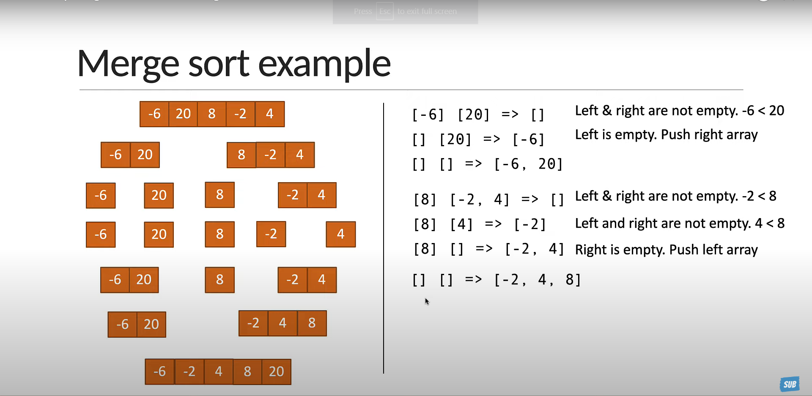
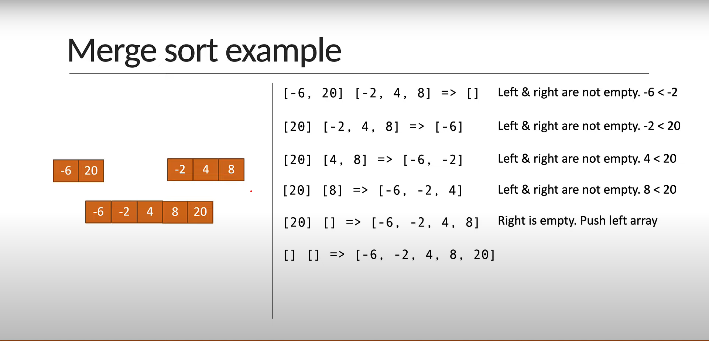

# Merge Sort

 *Problem:*  Give an array of Integers, sort the Array

    const arr = [-6,20,8,-2,-4]
    mergeSort(arr) => should return  [-6, -2,4,8,20]

## Merge Sort Idea 

 - Divide the array into **Sub Arrays**, each Containing only one element (An array with one element is considered sorted)
 -  Repeatedly merge the sub arrays to produce new sorted sub arrays until there is only one sub array remaining. that will be the sorted array.
 
 # Visual Explanation

 

 

